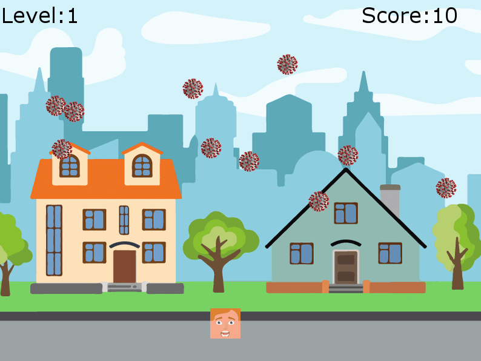

# Corona Dodge

### Dodge the corona virus and save yourself!

Made with [`pygame`](https://pypi.org/project/pygame/) in Python.

Install `pygame` using the following command

    pip install -r requirements.txt
